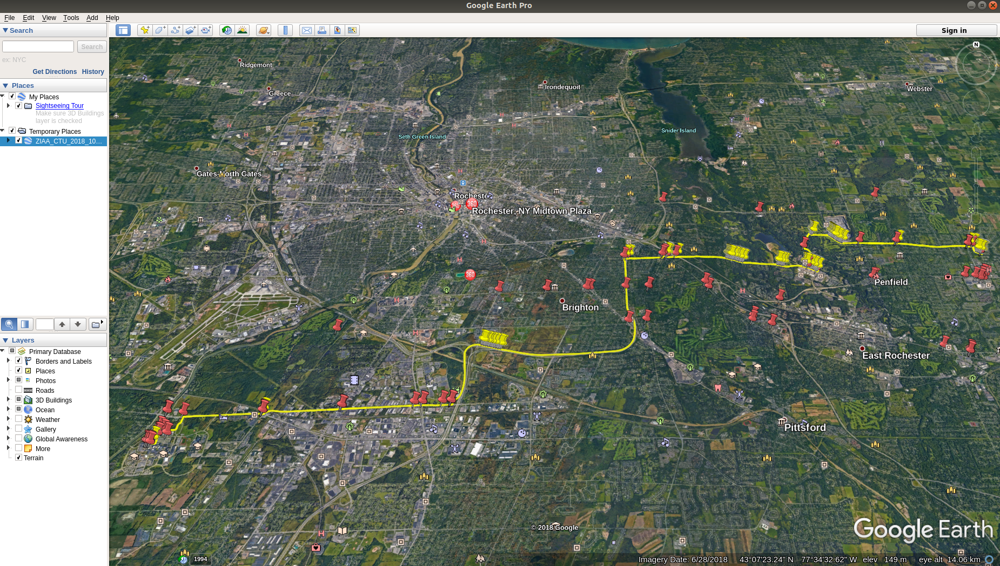

# Identify Left Turns from GPS Data

## Requirments
Software Prerequisites: Google Earth, Git, Pycharm(not compulsary but highly recommended)

Python Library Prerequisite: [geopy]

Installation Instructions: https://www.jetbrains.com/help/pycharm/installing-uninstalling-and-upgrading-packages.html

## Setup Instructions

Use the code to make a new Project in PyCharm

### Clone the repo using
```
git clone https://github.com/pranavmrane/Identify_Left_Turns_GIS.git
```

### Run Python Code

Run '__init__.py' to Generate .kml file in the folder:project_directory/GeneratedKMLFile

The best route will be specified in the output

### Open .kml file in Google Earth

The final output in Google Earth should look something like this: 

* Yellow Path - Best Path
* Red Pin - Stop Signs
* Yellow Pin - Left Turns

Read the Documentation/GPS Data Visualization and Convex Optimization_Report.pdf to understand the math.
